Exploring the Data Analytics Job Simulation Project
================

I was introduced to the job simulation resource to explore different careers. My interest is in data analytics, and here are the instructions for the relevant simulation: <https://intersectjobsims.com/library/using-data-to-make-predictions/>

Data cleanup
============

Before I import the data into R, I first looked at all the data in excel, and I made a few changes:
1. I noticed that the date column showed the data as date and time. But all the times were shown as 12am, so I reformatted the column to be date only.
2. The phone number, address lines and postal code info was hard to compare, because different countries have different systems. And since the state and country codes provide location information, I just deleted those columns.
3. I save the modifies data as a csv file for easier import

Prep the environment
====================

``` r
library(tidyverse)
```

    ## -- Attaching packages ------------------------------------------------------- tidyverse 1.2.1 --

    ## v ggplot2 2.2.1     v purrr   0.2.4
    ## v tibble  1.4.1     v dplyr   0.7.4
    ## v tidyr   0.8.0     v stringr 1.2.0
    ## v readr   1.1.1     v forcats 0.3.0

    ## -- Conflicts ---------------------------------------------------------- tidyverse_conflicts() --
    ## x dplyr::filter() masks stats::filter()
    ## x dplyr::lag()    masks stats::lag()

``` r
library(gridExtra)
```

    ## 
    ## Attaching package: 'gridExtra'

    ## The following object is masked from 'package:dplyr':
    ## 
    ##     combine

``` r
library(lme4)
```

    ## Loading required package: Matrix

    ## 
    ## Attaching package: 'Matrix'

    ## The following object is masked from 'package:tidyr':
    ## 
    ##     expand

``` r
setwd("~/GitHub/InterSECT_job_sim")
```

Import the data
===============

``` r
dat_sale <- read_csv("sales_data_sample-1.csv")
```

    ## Parsed with column specification:
    ## cols(
    ##   .default = col_character(),
    ##   ORDERNUMBER = col_integer(),
    ##   QUANTITYORDERED = col_integer(),
    ##   PRICEEACH = col_double(),
    ##   ORDERLINENUMBER = col_integer(),
    ##   SALES = col_double(),
    ##   QTR_ID = col_integer(),
    ##   MONTH_ID = col_integer(),
    ##   YEAR_ID = col_integer(),
    ##   MSRP = col_integer()
    ## )

    ## See spec(...) for full column specifications.

``` r
head(dat_sale)
```

    ## # A tibble: 6 x 20
    ##   ORDERNUMBER QUANTITYORDERED PRICEEACH ORDERLINENUMBER SALES ORDERDATE 
    ##         <int>           <int>     <dbl>           <int> <dbl> <chr>     
    ## 1       10107              30      95.7               2  2871 2/24/2003 
    ## 2       10121              34      81.4               5  2766 5/7/2003  
    ## 3       10134              41      94.7               2  3884 7/1/2003  
    ## 4       10145              45      83.3               6  3747 8/25/2003 
    ## 5       10159              49     100                14  5205 10/10/2003
    ## 6       10168              36      96.7               1  3480 10/28/2003
    ## # ... with 14 more variables: STATUS <chr>, QTR_ID <int>, MONTH_ID <int>,
    ## #   YEAR_ID <int>, PRODUCTLINE <chr>, MSRP <int>, PRODUCTCODE <chr>,
    ## #   CUSTOMERNAME <chr>, CITY <chr>, STATE <chr>, COUNTRY <chr>,
    ## #   CONTACTLASTNAME <chr>, CONTACTFIRSTNAME <chr>, DEALSIZE <chr>

``` r
dat_sale <- dat_sale %>% mutate (orderdate = parse_date(ORDERDATE, "%m/%d/%Y"))
```

Data exploration
================

Let's first look at the data distribution for some of the quantitative variables:
---------------------------------------------------------------------------------

``` r
phs <- hist(dat_sale$SALES)
```

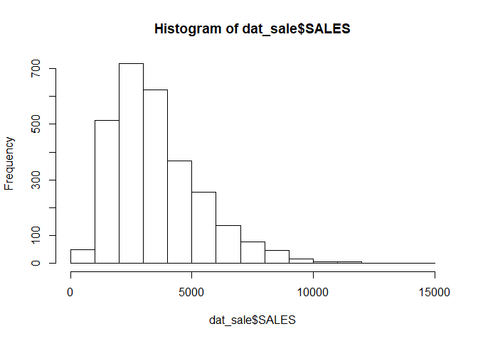 Mostly normal, with single peak around 3000 and slightly skewed to the right.

``` r
phq <- hist(dat_sale$QUANTITYORDERED, breaks = 40) 
```

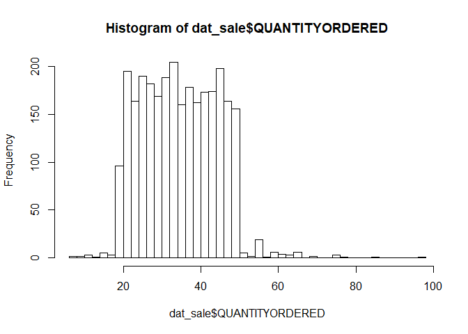 Not normal at all, more like uniform distibution between 20-50 with some outliers

``` r
phpr <- hist(dat_sale$PRICEEACH)
```

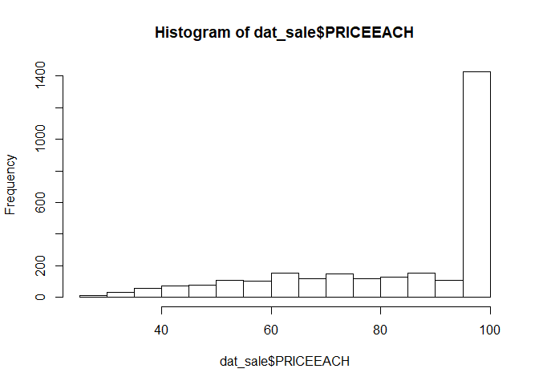 Not normal either, the bar of 100 is much higher than all others

``` r
pbn <- ggplot(dat_sale, aes(ORDERLINENUMBER))+geom_bar()
pbn
```

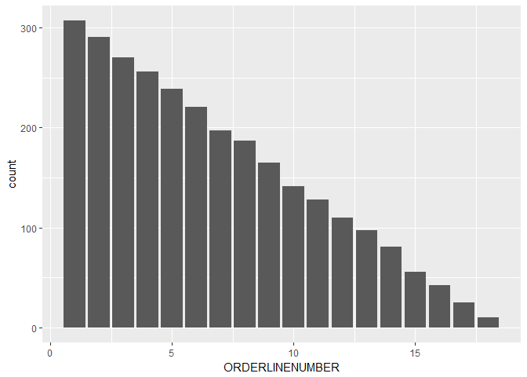 Very strange, monotonic decrease of counts as orderline\# increases. This might be an variable that's added for the simulation only.

``` r
pbd <- ggplot(dat_sale, aes(orderdate))+geom_bar()
pbd
```

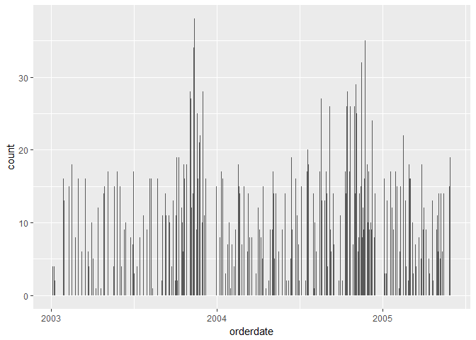 Possibly some seasonal pattern, that there is more sale at the end of the season **bold I think either the date or the quarter when the order is placed will be important**

``` r
pby <- ggplot(dat_sale, aes(YEAR_ID))+geom_bar()
range(dat_sale$orderdate)
```

    ## [1] "2003-01-06" "2005-05-31"

``` r
pby
```

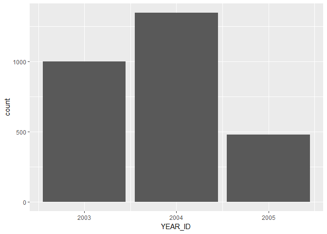 More sales in 2004, but the 2015 data only extend to 2005-05-31 **So I will need to be careful when interpreting trends about different years**

``` r
pbc <- ggplot(dat_sale, aes(PRODUCTLINE))+geom_bar()
pbc
```

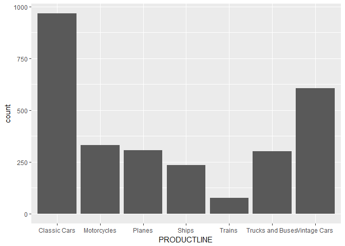 A lot of classic cars and less trains

``` r
pbcus <- ggplot(dat_sale, aes(CUSTOMERNAME))+geom_bar()
pbcus
```

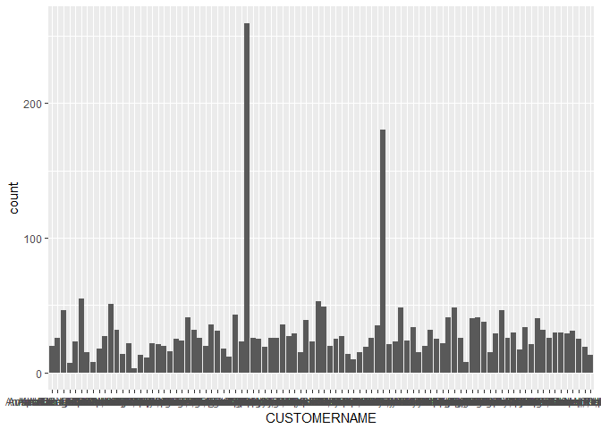 Two outlier customers that made &gt;150 orders

``` r
pbcity <- ggplot(dat_sale, aes(CITY, color = COUNTRY))+geom_bar()
pbcity
```

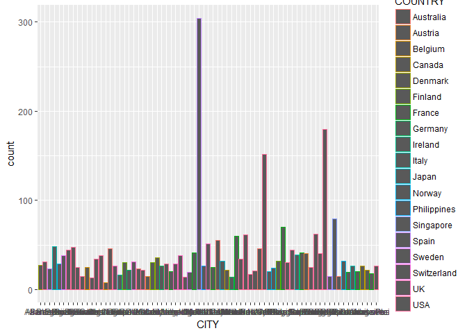 Three cities make the most orders, and I the bars look awful like the previous graph. Let's see if the top customors are from the same place:

``` r
dat_sale %>% group_by (CUSTOMERNAME) %>%
  summarize(orderN = n(), sale = mean(SALES))%>%
  ungroup() %>%
  summarize(median_order = median(orderN), median_sale = median(sale))
```

    ## # A tibble: 1 x 2
    ##   median_order median_sale
    ##          <dbl>       <dbl>
    ## 1         26.0        3539

``` r
dat_sale %>% group_by (CUSTOMERNAME) %>% 
  summarize(orderN = n(), sale = mean(SALES), 
            city = sample(CITY,1), country = sample(COUNTRY,1)) %>%
  filter(orderN > 50 ) # look at only customers with more than 50 orders
```

    ## # A tibble: 5 x 5
    ##   CUSTOMERNAME                 orderN  sale city       country  
    ##   <chr>                         <int> <dbl> <chr>      <chr>    
    ## 1 Australian Collectors, Co.       55  3654 Melbourne  Australia
    ## 2 AV Stores, Co.                   51  3094 Manchester UK       
    ## 3 Euro Shopping Channel           259  3522 Madrid     Spain    
    ## 4 La Rochelle Gifts                53  3399 Nantes     France   
    ## 5 Mini Gifts Distributors Ltd.    180  3638 San Rafael USA

It is clear that some of the customers are extreme in terms of the number of their orders, but theie order sizes are about average (~3500).

``` r
pbdeal <- ggplot(dat_sale, aes(DEALSIZE))+geom_bar()
pbdeal
```

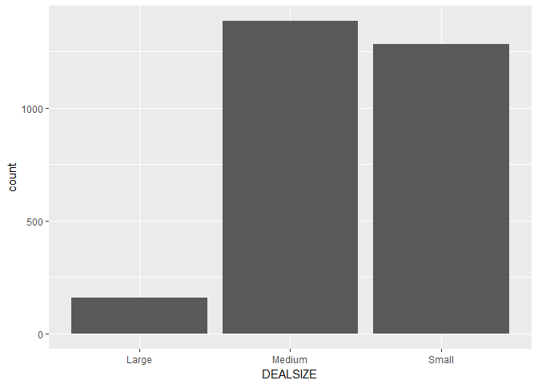 Most of the orders are small and medium. Compared to the previous table, it is clear that different customers are extreme in terms of order numbers and in terms of sales.

Let's build a model
===================

Before I model anything, first check whether correlations are as expected:
--------------------------------------------------------------------------

``` r
ggplot(dat_sale, aes(I(QUANTITYORDERED*PRICEEACH), SALES))+geom_point()
```

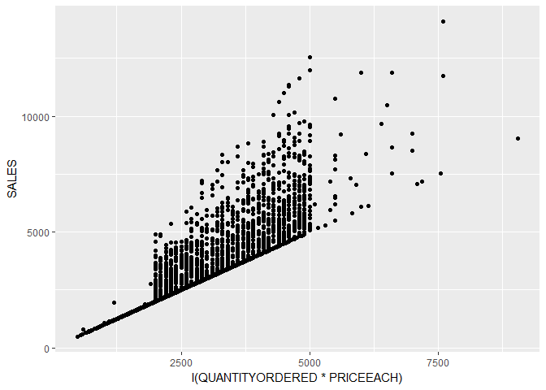 I was surprised to find that sales are different than the products of quantities and prices of each item. But that's good news for modeling. Since the points are spread out, I can have both factors in the same model.

``` r
ggplot(dat_sale, aes(SALES, color = DEALSIZE))+geom_bar()
```

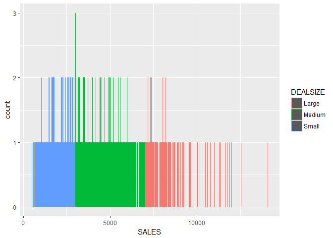 Sale size is just a categorical division of SALES, so there two variables cannot be in the same model.

``` r
dat_sale %>%
  group_by(MSRP,PRODUCTCODE) %>%
  summarise(n = n())
```

    ## # A tibble: 109 x 3
    ## # Groups: MSRP [?]
    ##     MSRP PRODUCTCODE     n
    ##    <int> <chr>       <int>
    ##  1    33 S24_1937       25
    ##  2    35 S24_2840       28
    ##  3    37 S24_2972       27
    ##  4    40 S32_2206       25
    ##  5    41 S24_3969       22
    ##  6    43 S50_1341       26
    ##  7    44 S24_2022       25
    ##  8    49 S72_1253       27
    ##  9    50 S18_4668       27
    ## 10    50 S24_1628       24
    ## # ... with 99 more rows

``` r
length(levels(as.factor(dat_sale$PRODUCTCODE)))
```

    ## [1] 109

``` r
length(levels(as.factor(dat_sale$MSRP)))
```

    ## [1] 80

So MSRP is nested in PRODUCTCODE... cannot have both of them in the same model

``` r
dat_sale %>%
  group_by(ORDERNUMBER) %>%
  summarise(n = n(), a = mean(SALES), b = sd(SALES))
```

    ## # A tibble: 307 x 4
    ##    ORDERNUMBER     n     a     b
    ##          <int> <int> <dbl> <dbl>
    ##  1       10100     4  3033  1602
    ##  2       10101     4  2858  1148
    ##  3       10102     2  3432  1946
    ##  4       10103    16  3419  1250
    ##  5       10104    13  3432  1426
    ##  6       10105    15  3925  2042
    ##  7       10106    18  3121  1003
    ##  8       10107     8  3223  1313
    ##  9       10108    16  3453  1512
    ## 10       10109     6  4566  2517
    ## # ... with 297 more rows

Why are order numbers not unique? I guess I can use order number as a predictor variable then

Generate the appropriate subset of data:
\* If sales is important, we only need to focus on orders that are either processed or in process.

``` r
data_model <- dat_sale %>% filter(STATUS %in% c("In Process", "Resolved", "Shipped")) %>%
  na.omit
```

Let's plug everything into a model:
-----------------------------------

``` r
FIT1 <- lmer(data = data_model, 
             SALES ~ scale(QUANTITYORDERED)*scale(PRICEEACH) + (ORDERLINENUMBER) + 
                     as.factor(QTR_ID) + as.factor(YEAR_ID) + 
                    (1|PRODUCTLINE) + (1|PRODUCTCODE) + (1|CUSTOMERNAME) + (1|CITY) + (1|STATE) + (1|COUNTRY) + (1|ORDERNUMBER)) 
summary(FIT1)
```

    ## Linear mixed model fit by REML ['lmerMod']
    ## Formula: 
    ## SALES ~ scale(QUANTITYORDERED) * scale(PRICEEACH) + (ORDERLINENUMBER) +  
    ##     as.factor(QTR_ID) + as.factor(YEAR_ID) + (1 | PRODUCTLINE) +  
    ##     (1 | PRODUCTCODE) + (1 | CUSTOMERNAME) + (1 | CITY) + (1 |  
    ##     STATE) + (1 | COUNTRY) + (1 | ORDERNUMBER)
    ##    Data: data_model
    ## 
    ## REML criterion at convergence: 20468.4
    ## 
    ## Scaled residuals: 
    ##     Min      1Q  Median      3Q     Max 
    ## -3.9079 -0.4666 -0.0335  0.3192  8.4298 
    ## 
    ## Random effects:
    ##  Groups       Name        Variance Std.Dev.
    ##  ORDERNUMBER  (Intercept)      0     0.0   
    ##  PRODUCTCODE  (Intercept) 334541   578.4   
    ##  CUSTOMERNAME (Intercept)      0     0.0   
    ##  CITY         (Intercept)      0     0.0   
    ##  STATE        (Intercept)      0     0.0   
    ##  PRODUCTLINE  (Intercept)  35289   187.9   
    ##  COUNTRY      (Intercept)      0     0.0   
    ##  Residual                 458635   677.2   
    ## Number of obs: 1280, groups:  
    ## ORDERNUMBER, 141; PRODUCTCODE, 109; CUSTOMERNAME, 46; CITY, 34; STATE, 16; PRODUCTLINE, 7; COUNTRY, 5
    ## 
    ## Fixed effects:
    ##                                         Estimate Std. Error t value
    ## (Intercept)                             3477.962    118.128   29.44
    ## scale(QUANTITYORDERED)                   974.612     19.651   49.60
    ## scale(PRICEEACH)                        1153.003     29.100   39.62
    ## ORDERLINENUMBER                           -9.833      4.810   -2.04
    ## as.factor(QTR_ID)2                        26.205     67.105    0.39
    ## as.factor(QTR_ID)3                         4.814     70.183    0.07
    ## as.factor(QTR_ID)4                        55.292     62.266    0.89
    ## as.factor(YEAR_ID)2004                     5.611     43.810    0.13
    ## as.factor(YEAR_ID)2005                    21.960     75.429    0.29
    ## scale(QUANTITYORDERED):scale(PRICEEACH)  348.947     20.251   17.23
    ## 
    ## Correlation of Fixed Effects:
    ##                     (Intr) sc(QUANTITYORDERED) s(PRIC ORDERL a.(QTR_ID)2
    ## sc(QUANTITYORDERED)  0.014                                              
    ## s(PRICEEACH         -0.006  0.028                                       
    ## ORDERLINENU         -0.261 -0.009               0.040                   
    ## a.(QTR_ID)2         -0.333 -0.025               0.020  0.053            
    ## a.(QTR_ID)3         -0.380  0.006               0.003 -0.044  0.514     
    ## a.(QTR_ID)4         -0.406 -0.011               0.010 -0.070  0.575     
    ## a.(YEAR_ID)2004     -0.286 -0.027               0.001  0.055  0.067     
    ## a.(YEAR_ID)2005     -0.385 -0.031              -0.002  0.041  0.299     
    ## s(QUANTITYORDERED):  0.022 -0.033              -0.011 -0.021 -0.048     
    ##                     a.(QTR_ID)3 a.(QTR_ID)4 a.(YEAR_ID)2004
    ## sc(QUANTITYORDERED)                                        
    ## s(PRICEEACH                                                
    ## ORDERLINENU                                                
    ## a.(QTR_ID)2                                                
    ## a.(QTR_ID)3                                                
    ## a.(QTR_ID)4          0.695                                 
    ## a.(YEAR_ID)2004      0.118       0.116                     
    ## a.(YEAR_ID)2005      0.514       0.559       0.393         
    ## s(QUANTITYORDERED): -0.034      -0.016      -0.002         
    ##                     a.(YEAR_ID)2005
    ## sc(QUANTITYORDERED)                
    ## s(PRICEEACH                        
    ## ORDERLINENU                        
    ## a.(QTR_ID)2                        
    ## a.(QTR_ID)3                        
    ## a.(QTR_ID)4                        
    ## a.(YEAR_ID)2004                    
    ## a.(YEAR_ID)2005                    
    ## s(QUANTITYORDERED): -0.040

Sorry about this huge table.
Let's first look at the random effects:
\* Only product code and product line had an effect. But from the previous data visualization, we know that cars sell better.
\* Custormer mame or location (city, state, country) have no effect.
Next, let's look at the fixed effects:
\* QuantityOrdered and PriceEach had the most significant effects, highes t values.
\* Sales in the the fourth quarter was higher, but the effect may not be significant.
+ (as.factor(QTR\_ID)4) has a large estimate (55) but low t value (-2.04)
\* OrderlineNumber was somewhat important. \* Year was not important.

With the first model, we can slim down the model a bit:
-------------------------------------------------------

First remove some of the extraneous fixed effects:

``` r
FIT2 <- update(FIT1, .~. -as.factor(QTR_ID) - as.factor(YEAR_ID))
anova(FIT1, FIT2)
```

    ## refitting model(s) with ML (instead of REML)

    ## Data: data_model
    ## Models:
    ## FIT2: SALES ~ scale(QUANTITYORDERED) + scale(PRICEEACH) + ORDERLINENUMBER + 
    ## FIT2:     (1 | PRODUCTLINE) + (1 | PRODUCTCODE) + (1 | CUSTOMERNAME) + 
    ## FIT2:     (1 | CITY) + (1 | STATE) + (1 | COUNTRY) + (1 | ORDERNUMBER) + 
    ## FIT2:     scale(QUANTITYORDERED):scale(PRICEEACH)
    ## FIT1: SALES ~ scale(QUANTITYORDERED) * scale(PRICEEACH) + (ORDERLINENUMBER) + 
    ## FIT1:     as.factor(QTR_ID) + as.factor(YEAR_ID) + (1 | PRODUCTLINE) + 
    ## FIT1:     (1 | PRODUCTCODE) + (1 | CUSTOMERNAME) + (1 | CITY) + (1 | 
    ## FIT1:     STATE) + (1 | COUNTRY) + (1 | ORDERNUMBER)
    ##      Df   AIC   BIC logLik deviance  Chisq Chi Df Pr(>Chisq)
    ## FIT2 13 20585 20652 -10279    20559                         
    ## FIT1 18 20593 20686 -10279    20557 1.4146      5     0.9227

The two models are essentially the same in terms of predicative power. The reduced model (FIT2) is slightly better, because it contains less variables.

Let's see if we can slim down the model further by removing random effects:

``` r
FIT3 <- update(FIT2, .~. - (1|CUSTOMERNAME) - (1|CITY) - (1|STATE) - (1|COUNTRY) - (1|ORDERNUMBER))
anova(FIT2, FIT3)
```

    ## refitting model(s) with ML (instead of REML)

    ## Data: data_model
    ## Models:
    ## FIT3: SALES ~ scale(QUANTITYORDERED) + scale(PRICEEACH) + ORDERLINENUMBER + 
    ## FIT3:     (1 | PRODUCTLINE) + (1 | PRODUCTCODE) + scale(QUANTITYORDERED):scale(PRICEEACH)
    ## FIT2: SALES ~ scale(QUANTITYORDERED) + scale(PRICEEACH) + ORDERLINENUMBER + 
    ## FIT2:     (1 | PRODUCTLINE) + (1 | PRODUCTCODE) + (1 | CUSTOMERNAME) + 
    ## FIT2:     (1 | CITY) + (1 | STATE) + (1 | COUNTRY) + (1 | ORDERNUMBER) + 
    ## FIT2:     scale(QUANTITYORDERED):scale(PRICEEACH)
    ##      Df   AIC   BIC logLik deviance Chisq Chi Df Pr(>Chisq)
    ## FIT3  8 20575 20616 -10279    20559                        
    ## FIT2 13 20585 20652 -10279    20559     0      5          1

Again the reduced model perform just as well. The simple fact of needing less data for the same power makes the last model superior.

I'm a little curious whether excluding the canceled orders did anything:

``` r
FITR <- lmer( data = dat_sale, 
             SALES ~ scale(QUANTITYORDERED)*scale(PRICEEACH) + ORDERLINENUMBER + 
                     (1|STATUS) +
                     (1|PRODUCTLINE) + (1|PRODUCTCODE))
summary(FITR)
```

    ## Linear mixed model fit by REML ['lmerMod']
    ## Formula: 
    ## SALES ~ scale(QUANTITYORDERED) * scale(PRICEEACH) + ORDERLINENUMBER +  
    ##     (1 | STATUS) + (1 | PRODUCTLINE) + (1 | PRODUCTCODE)
    ##    Data: dat_sale
    ## 
    ## REML criterion at convergence: 44829.9
    ## 
    ## Scaled residuals: 
    ##     Min      1Q  Median      3Q     Max 
    ## -4.8401 -0.4741 -0.0575  0.3335  9.1638 
    ## 
    ## Random effects:
    ##  Groups      Name        Variance Std.Dev.
    ##  PRODUCTCODE (Intercept) 336979   580.5   
    ##  PRODUCTLINE (Intercept)  30614   175.0   
    ##  STATUS      (Intercept)      0     0.0   
    ##  Residual                414914   644.1   
    ## Number of obs: 2823, groups:  PRODUCTCODE, 109; PRODUCTLINE, 7; STATUS, 6
    ## 
    ## Fixed effects:
    ##                                         Estimate Std. Error t value
    ## (Intercept)                             3525.170     94.040   37.49
    ## scale(QUANTITYORDERED)                   994.824     12.347   80.57
    ## scale(PRICEEACH)                        1171.501     19.523   60.00
    ## ORDERLINENUMBER                           -8.039      2.935   -2.74
    ## scale(QUANTITYORDERED):scale(PRICEEACH)  344.353     12.604   27.32
    ## 
    ## Correlation of Fixed Effects:
    ##                     (Intr) sc(QUANTITYORDERED) s(PRIC ORDERL
    ## sc(QUANTITYORDERED) -0.004                                  
    ## s(PRICEEACH          0.000  0.018                           
    ## ORDERLINENU         -0.203  0.021               0.029       
    ## s(QUANTITYORDERED): -0.004 -0.044               0.008  0.014

STATUS is not important.

*I would recommend FIT3 as the final model for future use* Basically:
SALES ~ scale(QUANTITYORDERED)\*scale(PRICEEACH) + ORDERLINENUMBER + (1|PRODUCTLINE) + (1|PRODUCTCODE)

PART 2. Which orders are more likely to be canceled.
----------------------------------------------------

To be added
